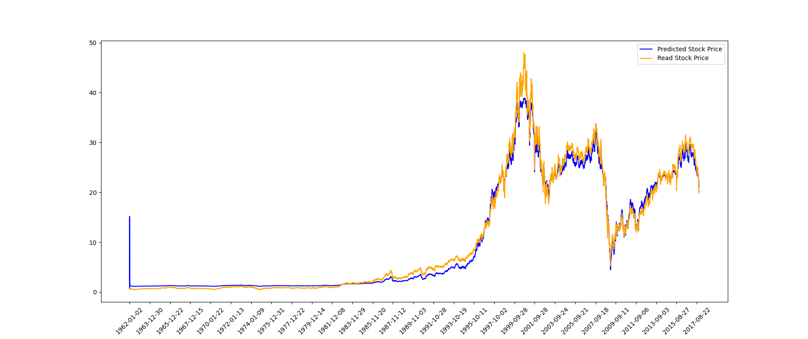

# GatedUnitsInRNN
GRU and LSTM implementation in PyTorch for StockPrediction.

# LSTM implementation
```python
class CellLSTM(nn.Module):
    def __init__(self, in_features, out_features, units=100, prob=False):
        super(CellLSTM, self).__init__()
        self.units = units
        self.prob = prob
        self.h = torch.zeros(1, units).type(torch.FloatTensor)
        self.c_t = torch.zeros(1, units).type(torch.FloatTensor)

        self.w_xh = Parameter(torch.rand(in_features, units), requires_grad=True)
 
        ### Initialize the weights of update-forget-output gates ###
        self.w_h_c = Parameter(torch.rand(units, units), requires_grad=True) # for c_tilda
        self.w_h_u = Parameter(torch.rand(units, units), requires_grad=True)
        self.w_h_f = Parameter(torch.rand(units, units), requires_grad=True)
        self.w_h_o = Parameter(torch.rand(units, units), requires_grad=True)

    def reset_hidden_state(self):
        self.c_t = torch.zeros(1, self.units).type(torch.FloatTensor)
        self.h   = torch.zeros(1, self.units).type(torch.FloatTensor)

    def forward(self, inputs):
        x = torch.matmul(inputs, self.w_xh)

        if(torch.isnan(x).any()):
            print("INPUTS : ", inputs)
            print("X_t : ", x_t)
            print("H : ", self.h)
            print("X_t + H : ", x)

        c_tilda = torch.tanh(torch.matmul(x, self.w_h_c))
        gamma_u = torch.sigmoid(torch.matmul(x, self.w_h_u))
        gamma_f = torch.sigmoid(torch.matmul(x, self.w_h_f))
        gamma_o = torch.sigmoid(torch.matmul(x, self.w_h_o))

        self.c_t = torch.mul(gamma_u, c_tilda) + torch.mul(gamma_f, self.c_t)
        self.h   = torch.mul(gamma_o,torch.tanh(self.c_t))

        return self.c_t, self.h
```

# LSTM Training results :
